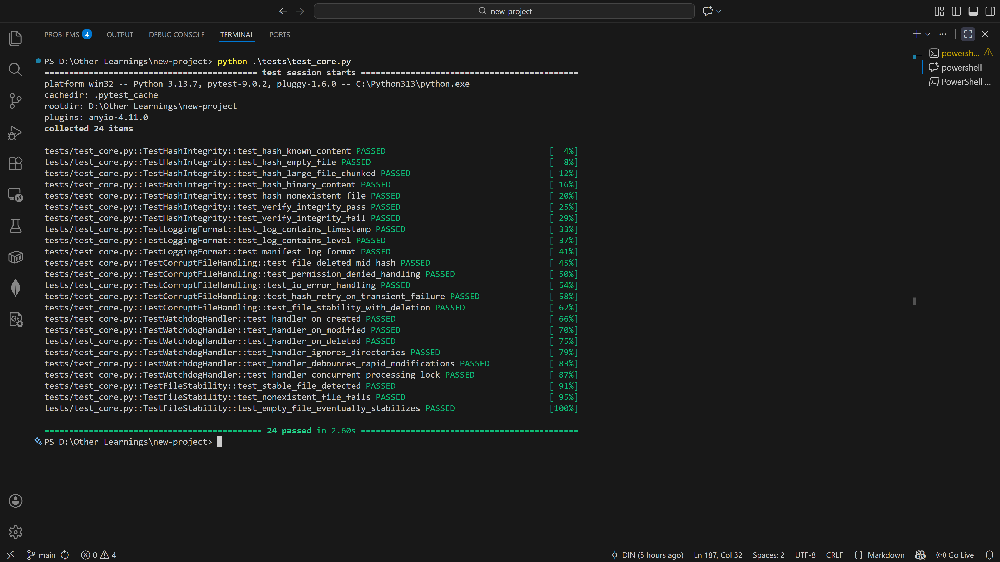

# Secure File Integrity & Aggregation Agent

[](https://www.python.org/downloads/)
[](https://www.docker.com/)
[](https://opensource.org/licenses/MIT)

> **Enterprise-grade file integrity monitoring solution for automated threat intelligence ingestion and security operations.**

---

## Overview

The **Secure File Integrity & Aggregation Agent** is a production-ready security tool designed for organizations requiring real-time visibility into file system changes. Built for SOC analysts, threat intelligence teams, and security engineers, this agent provides cryptographic verification of all file operations within monitored directories.

### Use Cases

- **Threat Intelligence Ingestion**: Automatically verify integrity of downloaded IOC feeds, STIX/TAXII bundles, and malware samples.
- **Secure File Transfer Monitoring**: Track and validate files entering sensitive directories.
- **Compliance Auditing**: Maintain immutable audit trails for regulatory requirements (SOC 2, HIPAA, PCI-DSS).
- **Incident Response**: Detect unauthorized file modifications in critical system directories.

---

## Features

| Feature | Description |
|---------|-------------|
| **Real-Time Monitoring** | Watchdog-based file system observer with sub-second event detection |
| **SHA-256 Integrity Checks** | Cryptographic hash verification for all file operations |
| **Immutable Logging** | Append-only audit log with ISO 8601 timestamps |
| **Hash Manifest** | Dedicated integrity manifest for forensic analysis |
| **Dockerized Deployment** | Lightweight container with non-root security |
| **Network Timeout Handling** | Graceful error handling for download operations |
| **Environment Configuration** | Flexible configuration via environment variables |

---

## Architecture

```
┌─────────────────────────────────────────────────────────────┐
│                  SECURE FILE MONITOR                        │
├─────────────────────────────────────────────────────────────┤
│                                                             │
│   ┌─────────────┐    ┌─────────────┐    ┌─────────────┐    │
│   │  Watchdog   │───▶│  SHA-256    │───▶│  Manifest   │    │
│   │  Observer   │    │  Hasher     │    │  Logger     │    │
│   └─────────────┘    └─────────────┘    └─────────────┘    │
│          │                                     │            │
│          ▼                                     ▼            │
│   ┌─────────────┐                      ┌─────────────┐     │
│   │  /monitored │                      │  /logs      │     │
│   │  /downloads │                      │  integrity  │     │
│   └─────────────┘                      │  manifest   │     │
│                                        └─────────────┘     │
└─────────────────────────────────────────────────────────────┘
```

---

## Quick Start

### Option 1: Docker Deployment (Recommended)

```bash
# Build the container
docker build -t secure-file-monitor:latest .

# Run with volume mounts
docker run -d \
  --name file-monitor \
  -v $(pwd)/monitored:/app/monitored \
  -v $(pwd)/downloads:/app/downloads \
  -v $(pwd)/logs:/app/logs \
  secure-file-monitor:latest
```

### Option 2: Local Installation

```bash
# Create virtual environment
python -m venv venv
source venv/bin/activate  # Linux/Mac
# venv\Scripts\activate   # Windows

# Install dependencies
pip install -r requirements.txt

# Run the monitor
python main.py
```

---

## Configuration

Configure the agent using environment variables:

| Variable | Default | Description |
|----------|---------|-------------|
| `WATCH_DIR` | `./monitored` | Directory to monitor for file changes |
| `DOWNLOAD_DIR` | `./downloads` | Directory for downloaded files |
| `LOG_FILE` | `./logs/integrity.log` | Path to structured log file |
| `HASH_MANIFEST` | `./logs/hash_manifest.log` | Path to hash manifest |
| `REQUEST_TIMEOUT` | `30` | HTTP request timeout (seconds) |
| `POLL_INTERVAL` | `5` | Observer poll interval (seconds) |

### Docker Environment Example

```bash
docker run -d \
  -e WATCH_DIR=/app/intel-feeds \
  -e REQUEST_TIMEOUT=60 \
  -v /opt/threat-intel:/app/intel-feeds \
  secure-file-monitor:latest
```

---

## Log Format

### Structured Application Log

```
2026-01-13 14:32:01 | INFO     | MONITOR_ACTIVE: Watching for file system events...
2026-01-13 14:32:15 | INFO     | FILE_CREATED: indicators.csv
2026-01-13 14:32:15 | INFO     | SHA256: a3f2b8c9d4e5f6a7b8c9d0e1f2a3b4c5d6e7f8a9b0c1d2e3f4a5b6c7d8e9f0a1
2026-01-13 14:32:15 | INFO     | MANIFEST_UPDATED: indicators.csv [CREATED]
```

### Hash Manifest (Audit Trail)

```
2026-01-13T14:32:15.123456Z | CREATED      | a3f2b8c9d4e5f6a7b8c9d0e1f2a3b4c5d6e7f8a9b0c1d2e3f4a5b6c7d8e9f0a1 | indicators.csv
2026-01-13T14:35:22.789012Z | DOWNLOADED   | b4c5d6e7f8a9b0c1d2e3f4a5b6c7d8e9f0a1b2c3d4e5f6a7b8c9d0e1f2a3b4c5 | malware_hashes.txt
2026-01-13T14:40:01.456789Z | MODIFIED     | c5d6e7f8a9b0c1d2e3f4a5b6c7d8e9f0a1b2c3d4e5f6a7b8c9d0e1f2a3b4c5d6 | config.yaml
```

---

## Reliability & Testing

This agent is battle-tested with a comprehensive `pytest` suite covering 24 edge cases, including:

* Race condition handling (rapid file modifications)
* Atomic logging verification
* Permission error recovery
* Large file chunking (memory safety)



---

## Security Considerations

- **Non-Root Execution**: Container runs as unprivileged `monitor` user
- **Read-Only Code**: Application code is immutable within container
- **Cryptographic Integrity**: SHA-256 provides collision-resistant file verification
- **Append-Only Logs**: Log files are opened in append mode to prevent tampering
- **Network Isolation**: No inbound ports exposed; outbound connections only

---

## Integration Examples

### SIEM Integration (Splunk/Elastic)

Forward logs to your SIEM for centralized monitoring:

```bash
docker run -d \
  -v /var/log/file-monitor:/app/logs \
  secure-file-monitor:latest

# Configure Splunk forwarder to monitor /var/log/file-monitor/
```

### Threat Intelligence Platform

```python
from main import download_file, verify_file_integrity

# Download and verify IOC feed
filepath = download_file("https://feeds.example.com/iocs.csv")
if filepath:
    # Verify against known hash
    is_valid = verify_file_integrity(filepath, "expected_sha256_hash")
```

---

## License

MIT License — See [LICENSE](LICENSE) for details.

---

## Author

**Security Engineering Team**  
Enterprise File Integrity Solutions

---

> *"Trust, but verify."* — This agent ensures every file is cryptographically verified before it enters your environment.
